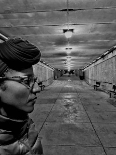
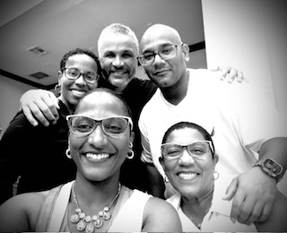

## PhD Student-Text & Technology, University of Central Florida

  
  
  

  

### About Me
My name is Angely C. Suarez DeJesus and I am currently pursuing a PhD in the Text & Technology doctoral program at  the University of Central Florida. 
My interests are within the areas of rhetoric and composition. It entails the exploration of the ways in which Generative AI algorithms managed by content moderators in large language models affect Latino women and other BIPOC groups through textual rhetoric. Furthermore, I am exploring the trend in publication of Latino women authors in academic forums. 

### Research Interests
- Technical Professional Communication
- Digital Humanities
- Digital Media

### My World
I love family and travel...The beach is my happy place!!

  
  
  

  
  
### Contact
- Email: an285811@ucf.edu

